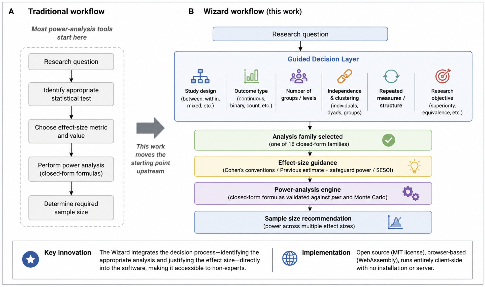
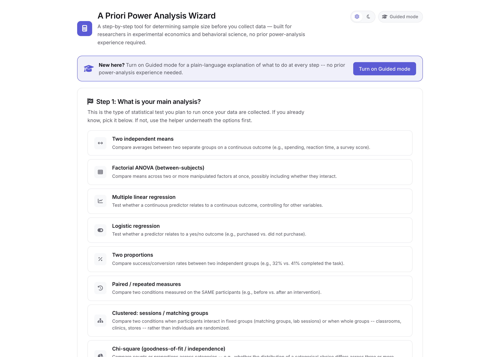
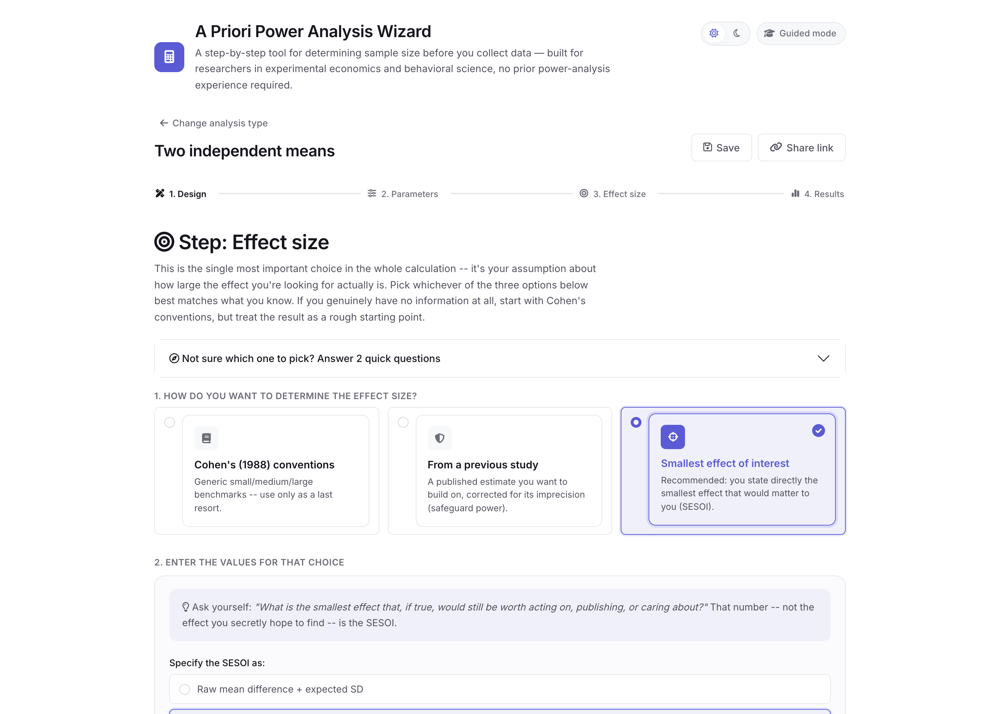
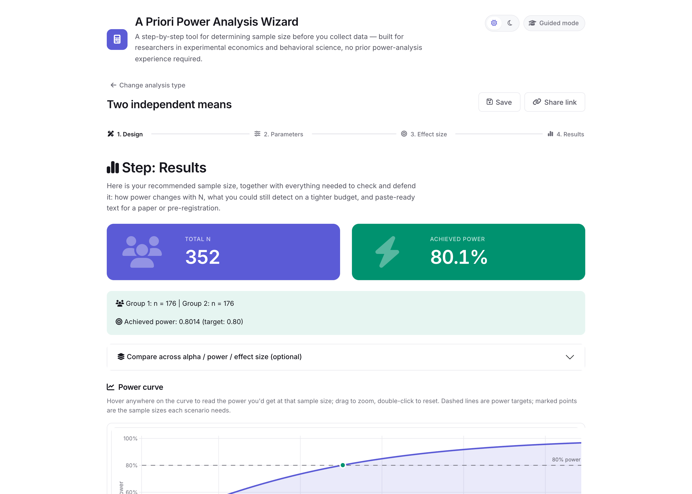

# A Priori Power Analysis Wizard

[](https://doi.org/10.5281/zenodo.21804595)
[](https://github.com/federicoatz/apriori-power-wizard/actions/workflows/test.yml)
[](LICENSE)
[](https://www.r-project.org/)

A step-by-step Shiny application that guides researchers in experimental
economics and behavioral science through an a priori (before data
collection) power analysis to determine required sample size.

## Quick start

```bash
git clone https://github.com/federicoatz/apriori-power-wizard.git
cd apriori-power-wizard
```

```r
install.packages("renv")
renv::restore()      # installs the exact package versions in renv.lock
shiny::runApp()      # opens the app at http://127.0.0.1:<port>
```

No local install at all? Try the live, browser-only build:
<https://federicoatz.com/apriori-power-wizard/>.

See [Reproducibility](#reproducibility) below for running the test suite
and validation scripts.



## What it does

Supports t-tests, ANOVA (including factorial, ANCOVA, and mixed/
repeated-measures designs), linear and logistic regression, clustered/
interacting-groups designs, equivalence tests, survival (time-to-event)
analysis, non-parametric tests, and other common analyses in experimental
and behavioral research -- sixteen families in total, each reachable
directly from a card or through a plain-language decision helper.



Every family walks through the same four steps -- design structure,
statistical parameters, effect size, results -- shown below for one
family; see "All sixteen analysis families" further down for the full
per-family list and every input each one takes.





### Planning a study that runs more than one analysis

Each family answers for one analysis. A study that plans several -- a
secondary outcome, a manipulation check, a second experiment -- needs a
sample large enough for all of them, and that is not something you can
read off any single family's result. The Results step therefore carries
an opt-in **study plan**: tick a box in each analysis that belongs to the
study, say which participants it runs on, and the app reports the binding
requirement, which analysis sets it, and how far the others fall short.
The figure is carried into the generated Method text, not just shown on
screen.

The combining rule is not simply "take the largest", which is why the app
asks rather than guesses:

| how two analyses relate | what the study needs |
|---|---|
| same participants (two measures on one session) | the **larger** of the two requirements |
| different participants (two experiments in one paper) | the **sum** |

Guessing wrong is costly in both directions, so nothing is inferred from
the mere fact that you have opened two families. Open five families to
price five unrelated studies and no combined total ever appears.

Note what this does *not* do: it combines sample sizes, it does not
correct alpha across families. Set the same "number of planned
comparisons" in each analysis for that.

## Why this app?

Most power calculators assume researchers already know which statistical
procedure and effect size are appropriate. This wizard reverses that
workflow: it guides users from the research question to the appropriate
analysis, *before* computing sample size, rather than requiring that
choice as a prerequisite for using the tool at all.

Three things follow from that:

- **The decision helper is part of the tool, not a manual step before
  it.** Three plain-language questions (how participants are sampled,
  what the outcome looks like, how it's explained) route a first-time
  user to the right analysis family, checked against seventeen real
  experimental-economics/behavioral-science scenarios in
  [VALIDATION.md](VALIDATION.md#decision-helper-scenario-benchmark).
- **Choosing the analysis and computing its power are separate code, not
  separate concerns bolted together.** `R/decision_helper.R` decides
  *which* family applies; `R/power_*.R` computes *that* family's power.
  Neither knows about the other -- see "Project structure" below.
- **Every number comes with its assumptions attached.** Effect sizes are
  justified through one of three explicit branches (never a silent
  default), and formulas that are approximations say so in the generated
  report text instead of presenting every number with equal, unwarranted
  confidence. See [VALIDATION.md](VALIDATION.md) for exactly which
  formulas are exact and which are documented approximations.

## Reproducibility

For a reviewer: clone, restore, run, test.

```bash
git clone https://github.com/federicoatz/apriori-power-wizard.git
cd apriori-power-wizard
```

```r
install.packages("renv")
renv::restore()      # installs the exact package versions in renv.lock
shiny::runApp()      # opens the app at http://127.0.0.1:<port>
```

```r
source("global.R")
testthat::test_dir("tests/testthat")   # 2,490 assertions as of v1.4.0
```

`source("global.R")` first is required -- it attaches the packages and
sources every file in `R/` and `modules/` that the test suite calls into;
running `testthat::test_dir()` on its own will fail with "could not find
function" errors.

`renv.lock` is machine-generated (`renv::snapshot()`, R 4.5.3), pins all
105 packages this repository actually uses -- app, tests, and
maintenance scripts alike -- with exact versions and CRAN as the
resolved source for each, and `renv::status()` reports the project
consistent as of the last snapshot. Both CI workflows
(`.github/workflows/*.yml`) use the same R version.

No local installation needed at all: the same code runs entirely in the
browser at <https://federicoatz.com/apriori-power-wizard/> (or your own
fork's GitHub Pages URL once deployed -- see "Deployment" below).

Every closed-form formula's correctness is documented family-by-family,
with real test tolerances and a reproducible, seeded Monte Carlo script,
in [VALIDATION.md](VALIDATION.md).

## All sixteen analysis families

Every family is a wizard with the same four steps: design structure,
statistical parameters, effect size, results.

**Main analysis**, one of:

- Two independent means
- Paired / repeated-measures comparison (two waves)
- Repeated-measures ANOVA (three or more waves, including the within x
  between interaction of a mixed design)
- Factorial between-subjects ANOVA
- One-way ANCOVA (group comparison adjusting for one covariate)
- Multiple linear regression
- Logistic regression
- Two independent proportions
- Bivariate correlation
- Chi-square (goodness-of-fit or independence), 2+ groups
- McNemar's test (paired binary outcomes)
- TOST equivalence test (two independent means)
- Wilcoxon-Mann-Whitney (two independent groups, skewed/bounded/ordinal
  outcome)
- Two-arm clustered design, continuous outcome (participants interacting
  in matching groups/lab sessions, or a cluster-randomized field trial)
- Clustered design, binary or categorical outcome
- Time-to-event log-rank test (a niche tool for this app's audience --
  e.g., time-to-decision in a strategic game, or attrition/dropout timing
  in a longitudinal study)

**Design structure.** For factorial ANOVA specifically: the number of
factors and levels, and, critically, which **focal contrast** power
should be computed for -- a specific main effect or the interaction,
never a generic omnibus test. A persistent warning flags that interaction
effects typically need far larger samples than the corresponding main
effect (~4x the per-cell N for a "halved effect" interaction).

**Statistical parameters**, shared across every family:

- Alpha (default .05) and power (default .80, one-click switch to .90),
  one- vs. two-tailed, balanced or custom allocation ratio.
- **Multiplicity correction** for multiple planned comparisons: set the
  number of comparisons and alpha is treated as the family-wise rate,
  corrected by Bonferroni (default) or Šidák, with the method, the
  per-test alpha, and what the correction cost in participants all
  disclosed automatically in the results and the report text.
- **Expected attrition/exclusion rate**: the app reports both the N the
  analysis needs and the larger N to actually recruit
  (`analysis N / (1 - rate)`), disclosed in the report text.

**Effect size**, three explicit branches for most families:

- **Cohen's conventions** (small/medium/large), flagged as arbitrary,
  field-agnostic thresholds.
- **Previous study + safeguard power** (Perugini, Gallucci & Costantini,
  2014): enter the published effect size and the original study's N; the
  app computes a one-sided confidence interval (default 80%) around it
  and uses its lower bound as a conservative, publication-bias-corrected
  input. Naive N and safeguard-corrected N are shown side by side. For
  the Wilcoxon-Mann-Whitney family the published statistic can be entered
  as P(X < Y), the U statistic, or the reported z, and the interval is
  built directly on the P(X < Y) scale (Hanley & McNeil, 1982) with no
  normality assumption.
- **SESOI** (smallest effect size of interest), in raw units (with an
  expected SD) or already-standardized units.

McNemar's test and the TOST equivalence test use a simpler, direct-entry
effect-size step instead: McNemar's effect is genuinely two-dimensional
(two discordant-pair probabilities), and TOST's key parameter (the
equivalence margin) is inherently a directly-stated quantity, so neither
fits the three-branch framework above.

**Results**: total N and per-group/per-cell N (always rounded up), a
power-vs-N curve with the solution highlighted, an inverse sensitivity
analysis (minimum detectable effect for a budget-constrained maximum N),
an optional **budget** panel, and a paste-ready English report/
pre-registration text block with full method citations, exportable as
HTML or PDF.

The budget panel exists because experiments -- especially in experimental
economics -- pay their participants, so a sample size is also a line in a
grant application. Enter the cost of one participant (show-up fee plus
expected average earnings) and any fixed costs to turn N into a total.
Enter a fixed budget instead to see how many participants it covers and,
reusing the same sensitivity machinery, the smallest effect that sample
could still detect. Amounts are labelled in euro, pound, or US dollar
(cosmetic only -- the choice affects no calculation).

## Saving, sharing, and resuming a project

Because the browser-only build has no server-side storage, whatever you
enter would normally be lost on a page reload. Every family page has
**Save** and **Share link** buttons (top-right, next to the family
title):

- **Save** downloads the current family's inputs as a small `.json`
  file. **Load a saved project**, next to the "Start" button on Step 1,
  reopens one later -- exactly where you left off, including which
  sub-step you were on.
- **Share link** rewrites the page's own URL to encode the same state as
  a query parameter and copies it to the clipboard; anyone who opens that
  link lands directly on the same family with the same inputs already
  filled in, no file needed.

Both funnel through the same pure serialization logic
(`R/project_state.R`, unit-tested in `tests/testthat/test-project_state.R`):
capture every input belonging to the active family, JSON-encode it, and
(for the link) base64url-encode that JSON for the URL. Restoring waits
for the target family's UI to actually be inserted into the page (lazy
loading, see below) before sending the input values, via
`session$onFlushed()`.

## Designed for first-time users

The app assumes no prior power-analysis experience:

- **Step 1** includes a "Not sure which analysis to choose?" helper: three
  plain-language questions (continuous or binary outcome? how many
  groups/predictors? interaction or not?) recommend a test family and can
  jump straight into its wizard.
- Every input that uses statistical vocabulary (alpha, power, Cohen's d/f/h,
  allocation ratio, safeguard confidence level, ...) carries an inline "?"
  tooltip with a plain-language explanation, reachable on hover without
  leaving the page.
- Each design step includes a short worked example ("does a reminder email
  predict task completion?") so users can map their own study onto the
  right inputs.
- The effect-size step opens with a one-line prompt -- "what is the
  smallest effect that would still be worth acting on?" -- to anchor the
  SESOI branch, which is the recommended default over Cohen's generic
  benchmarks.
- **Worked examples** ("Start from a worked example instead", on Step 1):
  nine complete, ready-made designs drawn from paradigms this audience
  runs -- public goods and dictator games, trust games, risk elicitation,
  Stroop, learning across rounds, pretest/posttest -- each loading every
  step populated and landing straight on the results, so a first-time user
  can see what a finished analysis looks like before building their own.
  Mechanically these are just hard-coded instances of the same state
  object Save/Load and share-links serialize (`R/example_library.R`), so
  they reuse the existing restore path with no extra plumbing. Their
  numbers are labelled prominently as illustrative starting points, not
  empirical constants.
- **Guided mode** (toggle in the top-right of the header, off by
  default): adds a longer "In plain language" explanation box to every
  step of every family, written for someone who has never run a power
  analysis before. Every box is always present in the page but hidden by
  CSS (`.guided-explain` in `www/styles.css`) unless the toggle is on, so
  flipping it takes effect instantly across every step and family --
  including ones already visited earlier in the session -- with no
  server round trip, the same way the light/dark theme toggle works.

## Look and feel

Modern product UI in **two themes**, light and dark, with a toggle in the
top-right of the header. Soft raised cards, hairline borders, large
display numerals for the headline results, one strong accent per theme
(indigo in light, cyan in dark), and motion used only to explain state
changes.

Structurally it's [`bslib`](https://rstudio.github.io/bslib/) (Bootstrap 5)
with icon-labeled sections (via `shiny::icon()` / Font Awesome 6, bundled
with recent Shiny) and `bslib::value_box()` summaries on the results step.

### Theming

Every colour is a CSS custom property, and the two themes are two blocks
of the same variable names selected by a `data-theme` attribute on
`<html>`. Switching is instant and entirely client-side -- no server round
trip, no re-render.

The visitor's choice is remembered in `localStorage`. On a first visit
with no saved choice, the app follows the OS-level
`prefers-color-scheme` (and keeps following it, live, until the visitor
picks a theme explicitly). A small inline script in `<head>` applies the
theme *before* first paint, so a dark-mode user never sees a white flash.

**Where the styling lives -- and why.** `app.R` uses a plain, uncustomized
`bs_theme(version = 5)`. Passing colors or fonts to `bs_theme()` makes
bslib recompile Bootstrap's Sass at runtime through compiled libsass
bindings, which is unreliable inside webR/shinylive. So *all* of the app's
branding lives in plain CSS custom properties at the top of
`www/styles.css` (the two `:root` / `[data-theme="dark"]` blocks). **To
re-skin the app, edit those two blocks -- nothing else should need to
change**, and you should not need to touch `bs_theme()`.

Because the power curve is drawn by R (which can't read CSS variables),
the active theme is reported back to the server as a root-level
`pw_theme` input and resolved by `app_palette()` in `global.R`. Module
sessions can't read root-level inputs directly, so the top-level server
parks the reactive in `session$userData`, which Shiny shares across
module sessions while keeping it isolated per user session. Keep
`APP_PALETTES` in `global.R` in sync with the `:root` blocks in
`styles.css`.

### Interactivity

- **Interactive power curve.** If [`plotly`](https://plotly.com/r/) is
  installed, the curve supports hover readout (N and power at any point),
  drag-to-zoom, and PNG/SVG export (both via plotly's own client-side
  modebar, no server round trip). If it isn't, the app silently falls
  back to the static `ggplot2` version -- see `HAS_PLOTLY` in
  `global.R` -- with its own "Download plot as SVG" button. The fallback
  is deliberate: the browser-only build depends on webR's WebAssembly
  package repository, and a missing or ABI-mismatched package would
  otherwise take the whole app down at startup. Worst case here is a
  less fancy chart, not a blank page.
- **Compare across alpha, power, AND effect size.** Every family's
  Results step has an optional "Compare across alpha / power / effect
  size" panel: tick extra significance levels, power targets, or effect
  sizes (framed as "X% weaker/stronger" than what you entered, since most
  families here don't have a Cohen's-style small/medium/large convention
  that applies) to see each scenario's required N plotted together on the
  same curve. Not offered for McNemar's test or logistic regression,
  whose effect isn't a single freely-rescalable number.
- **Animated result counters.** The value-box numbers count up when they
  change. This is decorative only: the DOM holds the final, correct string
  before the animation starts and the animation always terminates on
  exactly that string, so it cannot alter a displayed result.
- **Step transitions**, hover lift on the analysis cards, and an animated
  progress indicator.
- All motion respects `prefers-reduced-motion: reduce`.

### Fonts

Inter is loaded from Google Fonts in `app.R`'s `tags$head`, with
`display=swap` and a full system fallback stack declared in `styles.css`.
If it can't load -- offline use, a blocked CDN, a restrictive network --
the app renders immediately in the native UI sans and stays perfectly
legible. To make the app fully self-contained, delete the three
`fonts.googleapis.com` / `fonts.gstatic.com` `tags$link()` calls in
`app.R` and the fallback takes over permanently.

## What it deliberately does NOT do

- No Monte Carlo simulation-based power analysis (no `simr`, no
  bootstrap/simulation loops). Every calculation in this version is
  closed-form and returns in well under a second.
- No generic "omnibus ANOVA" power number -- factorial power is always
  computed for the specific focal contrast the user names.
- No silent defaults: every number the app produces is shown together
  with the assumptions (alpha, power, tails, allocation, effect-size
  branch and its justification) that generated it.

## Project structure

```
apriori-power-wizard/
├── app.R                     # Wizard shell: Step 1, decision helper, routing, bslib theme
├── global.R                  # Package loading + sources R/ and modules/ + shared color palette
├── R/                         # Pure, testable calculation functions (no Shiny)
│   ├── decision_helper.R           # Step 1 decision-tree logic (recommend_family())
│   ├── utils.R
│   ├── effect_size_conventions.R   # Cohen's (1988) benchmarks
│   ├── safeguard_power.R           # Perugini et al. (2014) safeguard power
│   ├── sesoi.R                     # Raw-unit <-> standardized-unit conversions
│   ├── power_two_means.R           # pwr::pwr.t.test / pwr.t2n.test
│   ├── power_proportions.R         # pwr::pwr.2p.test / pwr.2p2n.test
│   ├── power_regression.R          # pwr::pwr.f2.test
│   ├── power_logistic.R            # Demidenko (2007), base R only (no external dependency)
│   ├── power_anova_factorial.R     # Noncentral-F (Cohen 1988), base R only (no external dependency)
│   ├── power_paired_t.R            # pwr::pwr.t.test(type = "paired")
│   ├── power_clustered.R           # Design-effect inflation (Donner & Klar, 2000) + noncentral t on cluster-level df
│   ├── power_chisq.R               # pwr::pwr.chisq.test (Cohen 1988, ch. 7)
│   ├── power_correlation.R         # pwr::pwr.r.test (Cohen 1988, ch. 3)
│   ├── power_mcnemar.R             # Connor (1987), base R only (no external dependency)
│   ├── power_tost.R                # Exact noncentral-t TOST (Phillips 1990), base R only
│   ├── power_ancova.R              # pwr::pwr.f2.test with covariate-adjusted f2 (Cohen 1988; Borm et al. 2007)
│   ├── power_survival.R            # Schoenfeld (1983) log-rank events formula, base R only
│   ├── power_wilcoxon.R            # Noether (1987) Mann-Whitney rank-sum formula, base R only
│   ├── power_rm_anova.R            # Repeated-measures noncentral F with rho and sphericity correction, base R only
│   ├── power_clustered_cat.R       # Design-effect inflation of the proportions / chi-square families
│   ├── example_library.R           # Pre-filled worked examples offered on Step 1
│   ├── project_state.R             # Save/load/share-link JSON (de)serialization
│   ├── study_plan.R                # Combining several families into one recruitment target (max within a sample, sum across samples)
│   ├── power_curve.R               # Generic power-vs-N curve generator
│   ├── sensitivity_analysis.R      # Generic inverse/minimum-detectable-effect
│   └── report_text.R               # Paste-ready report text builder
├── modules/                   # Shiny modules -- one per test family
│   ├── common_ui.R                 # Shared UI fragments (params step, effect-size step, nav)
│   ├── common_results.R            # Shared results step (plot, sensitivity, export)
│   ├── mod_two_means.R
│   ├── mod_proportions.R
│   ├── mod_regression.R
│   ├── mod_logistic.R
│   ├── mod_anova_factorial.R
│   ├── mod_paired_t.R
│   ├── mod_clustered.R
│   ├── mod_chisq.R
│   ├── mod_correlation.R
│   ├── mod_mcnemar.R
│   ├── mod_tost.R
│   ├── mod_ancova.R
│   ├── mod_survival.R
│   ├── mod_wilcoxon.R
│   ├── mod_rm_anova.R
│   └── mod_clustered_cat.R
├── www/
│   └── styles.css
├── tests/
│   ├── testthat.R
│   └── testthat/              # One test file per R/ calculation module, plus test-decision_helper.R
├── validation/                # Evidence beyond unit tests -- see VALIDATION.md
│   ├── monte_carlo_validation.R    # Seeded Monte Carlo checks for formulas with no pwr reference
│   ├── scenario_benchmark.csv      # Decision-helper scenarios -> expected family
│   ├── scenario_validation.R       # Checks recommend_family() against scenario_benchmark.csv
│   └── accessibility_check.R       # axe-core audit of the exported build
├── deploy/
│   ├── export_shinylive.R     # Local build script for the browser-only (webR) deployment
│   ├── serve_static.R         # Minimal static server, used by the CI smoke test/audit
│   └── smoke_test.R           # Headless-browser check that the exported build actually boots
├── .github/
│   ├── workflows/
│   │   ├── deploy-shinylive.yml    # CI: build + smoke test + accessibility audit + publish
│   │   └── test.yml                # CI: run the full testthat suite on every push/PR
│   └── ISSUE_TEMPLATE/
│       └── bug_report.yml
├── renv.lock                  # Machine-generated (renv::snapshot()) -- see "Reproducibility"
├── .Rprofile                  # Activates renv for this project (source("renv/activate.R"))
├── renv/                      # renv's own bootstrap files; renv/library/ is gitignored
├── DESCRIPTION                # Dependency/metadata manifest (Imports, license, version) --
│                               # not an installable package; Type: project keeps renv using
│                               # the local renv/library/ rather than a package-style cache
├── CHANGELOG.md
├── CONTRIBUTING.md
├── VALIDATION.md
└── README.md
```

Every `R/power_*.R` file exposes three kinds of pure functions, all
directly unit-testable without starting Shiny:

- `power_<family>_n(...)` -- solves for required sample size
- `power_<family>_at_n(...)` -- power achieved at a given N (used by the
  power curve)
- `power_<family>_min_*(...)` -- minimum detectable effect at a given N
  (used by the sensitivity analysis)

## Test reference values

See "Reproducibility" above for how to run the suite. Reference values
for the two-means, two-proportions, multiple regression,
and logistic-regression tests are checked against textbook / G*Power /
published-documentation numbers (see comments in each test file for the
exact source; the logistic-regression tests are pinned against the
reference values published in WebPower's own documentation, since
`R/power_logistic.R` reimplements the same Demidenko 2007 formula without
depending on that package). The factorial-ANOVA tests are similarly
pinned: the one-way case is cross-checked directly against
`pwr::pwr.anova.test()` (an independent, widely-used implementation of
the same closed-form relationship), and the two-factor case was
validated against `Superpower::ANOVA_exact()`'s output across 12 designs
(0 numerical difference) before that dependency was removed -- see the
header comment in `R/power_anova_factorial.R` for the full derivation.

## Deployment

### shinyapps.io

```r
install.packages("rsconnect")
rsconnect::setAccountInfo(name = "<your-account>", token = "<token>", secret = "<secret>")
rsconnect::deployApp(appDir = ".", appName = "power-analysis-wizard")
```

### Posit Connect / Shiny Server

Copy the project directory (including `renv.lock`) to the server and
point Shiny Server / Connect at it; both will call `renv::restore()`
automatically if `renv` integration is enabled, or run it manually first.

### Privacy

Full notice: **[PRIVACY.md](PRIVACY.md)**. Data controller: Federico Atzori,
University of Cagliari.

The claims below were verified by auditing the deployed site's network traffic
and storage, not inferred from the source:

| | |
|---|---|
| Cookies | none |
| Inputs transmitted | none -- every calculation runs locally in WebAssembly |
| Third-party requests | none, other than the analytics beacon below |
| `localStorage` | written only if the visitor actively toggles the theme or Guided mode (`pw-theme`, `pw-guided`); nothing otherwise |
| Personal data collected by the app | none; there is no account, login, or database |

The webfont is self-hosted (`www/fonts/`) precisely so that opening the page
does not disclose the visitor's IP address to a font CDN -- that request was,
before v0.14.0, the only third-party call the application made.

Two things are outside the app's control and are disclosed in the notice: GitHub
Pages processes the technical data needed to serve a page, including IP
addresses, in logs the site owner cannot see; and the analytics service below
receives a request per page view.

This describes what the software does. It is not a legal assessment.

### Browser-only deployment (shinylive + GitHub Pages, no server at all)

This app does no simulation and every calculation is closed-form and
sub-second, which makes it a good candidate for
[shinylive](https://posit-dev.github.io/r-shinylive/): a build of the app
compiled to WebAssembly (via webR) that runs entirely inside the visitor's
browser tab. There is no R process on a server at all -- you host a folder
of static files (HTML/JS/wasm) on GitHub Pages, Netlify, or any static
file host, for free, with no usage caps and no "app asleep" cold starts.

**Step 1 -- test the export locally, before deploying anywhere.**

```r
# from the project root (the folder containing app.R)
source("deploy/export_shinylive.R")
```

This installs the `shinylive` package if needed and writes a static
build to `_site/`. The first run downloads webR and the WebAssembly
builds of every package this app uses, so it can take a few minutes.

**Step 2 -- preview it in a real browser before trusting it.**

```r
install.packages("httpuv")  # if not already installed
httpuv::runStaticServer("_site")
```

Open the printed local URL, open the browser's developer console (F12 /
Cmd+Opt+I), and click through the *entire* wizard once -- including the
Results step, which is where every package actually gets exercised.
**Watch the console for red package-loading errors.** This is the one
step that genuinely needs to happen on your machine: nothing here was
verified against a live webR runtime while building this app, because no
R installation was available in that environment.

If you see a `call_indirect`-style crash at startup, that's a WebAssembly
ABI mismatch in one of the app's compiled R package dependencies -- see
"Troubleshooting" below for how to isolate which one.

**Step 3 -- deploy to GitHub Pages.**

The included `.github/workflows/deploy-shinylive.yml` automates steps 1
onward on every push to `main`:

1. Push this project to a GitHub repository.
2. In the repo, go to **Settings → Pages → Build and deployment → Source**
   and select **GitHub Actions**.
3. Push to `main` (or trigger the workflow manually from the **Actions**
   tab). The workflow installs `shinylive`, runs the same export as
   above, and publishes the result.
4. Once the run finishes, your app is live at
   `https://<your-github-username>.github.io/<repo-name>/`.

Because this is a static site, there's no `renv::restore()` step at
runtime -- the exact package versions get baked into the exported
`_site/` folder at build time, so pin them in the GitHub Actions
workflow (or in a project-level `renv.lock`, restored before the export
step) if you need long-term reproducibility of a specific build.

**What's different in the browser-only build:** everything works exactly
as in the server-hosted version except the "Download PDF report" button,
which is hidden automatically (see `IS_SHINYLIVE` in `global.R`) because
PDF rendering needs a pandoc/LaTeX toolchain that doesn't exist inside a
browser sandbox. The HTML report export has no such dependency and works
identically in both builds.

**Troubleshooting: `call_indirect to a signature that does not match`
(or any other low-level WebAssembly crash right as the app starts).**
This is a WebAssembly ABI mismatch -- some compiled code was called with
a signature the wasm runtime didn't expect -- not an R logic error, so it
won't mention any of your own code. The most likely source in this app is
`bslib`'s theming: customizing `bs_theme()` with colors/fonts/radii (via
`primary =`, `base_font =`, etc.) makes bslib recompile Bootstrap's Sass
at runtime through compiled `sass`/libsass bindings, and that live
recompilation is not reliable inside webR. For this reason `app.R` uses a
**plain, uncustomized** `bs_theme(version = 5)` with no color/font args --
all of the app's actual branding lives in plain CSS in `www/styles.css`
instead, so this costs nothing visually. If you've modified `app_theme`
in `app.R` and hit this error, that's the first thing to revert.

If the crash persists even with a plain `bs_theme()`, the next suspect is
a version-mismatched WebAssembly build of one of the app's compiled
(C/C++/Fortran) R package dependencies. This is exactly what happened
during development: `WebPower`'s dependency chain (`lme4`, `Matrix`,
`lavaan`, `PearsonDS`) triggered this crash, and the fix was to drop
`WebPower` entirely and reimplement the same Demidenko (2007) formula
directly in `R/power_logistic.R` using only base R, validated against
WebPower's own published reference values
(`tests/testthat/test-power_logistic.R`). This specific cause is closed. If a *new*
crash like this shows up after adding a package of your own, isolate it
the same way it was isolated here: temporarily remove the family module
that uses the suspect package from `app.R` (its `tabPanelBody()` block
and its `mod_<family>_server()` call) and from `global.R`'s `library()`
calls, re-export, and retest -- if the crash disappears, that package's
WebAssembly build is the culprit.

### PDF export dependency

The "Download PDF report" button uses `rmarkdown::render()` with
`pdf_document`, which requires a LaTeX distribution (e.g.
`tinytex::install_tinytex()`) on the deployment server. If no LaTeX
engine is available, the app falls back to a plain-text file rather than
producing a broken PDF; the HTML export has no such dependency and always
works.

## Extending: adding a simulation-based module later

The codebase is structured so a future simulation-based module (e.g.,
mixed models via `simr`) can be added without touching existing files:

1. Add pure functions to a new `R/power_mixed_models.R`, following the
   `power_*_n()` / `power_*_at_n()` / `power_*_min_*()` naming convention
   used by every other family.
2. Add a new `modules/mod_mixed_models.R` following the same
   `mod_<family>_ui()` / `mod_<family>_server()` pattern as the existing
   family modules, calling the shared `params_step_ui()`,
   `effect_size_step_ui()`, `results_panel_ui()` and
   `wire_results_server()` helpers from `modules/common_ui.R` /
   `modules/common_results.R`.
3. Add a `"mixed_models"` branch to `generate_power_curve()`
   (`R/power_curve.R`) and `sensitivity_min_effect()`
   (`R/sensitivity_analysis.R`).
4. Register the new module's UI/server in `app.R`.

No existing file needs to change beyond those two small `switch()`
additions -- this was a deliberate design constraint from the start.

## Validation

Every closed-form formula is checked either against the `pwr` R package
(near-exact agreement) or against a seeded, reproducible Monte Carlo
simulation of the actual statistical test. See [VALIDATION.md](VALIDATION.md)
for the full family-by-family breakdown, real tolerances from the test
suite, and instructions to reproduce every check yourself
(`Rscript validation/monte_carlo_validation.R`).

## Method references

- Cohen, J. (1988). *Statistical Power Analysis for the Behavioral
  Sciences* (2nd ed.). Routledge.
- Champely, S. (2020). `pwr`: Basic Functions for Power Analysis. R
  package.
- Demidenko, E. (2007). Sample size determination for logistic regression
  revisited. *Statistics in Medicine*, 26(18), 3385-3397. (The formula
  this app implements directly in `R/power_logistic.R`, without a
  `WebPower` dependency; validated against `WebPower`'s own published
  reference values.)
- Perugini, M., Gallucci, M., & Costantini, G. (2014). Safeguard power as
  a protection against imprecise power estimates. *Perspectives on
  Psychological Science*, 9(3), 319-332.
- Donner, A., & Klar, N. (2000). *Design and Analysis of Cluster
  Randomization Trials in Health Research*. Arnold. (Source of the
  design-effect formula, `1 + (m-1)xICC`, used in
  `R/power_clustered.R`. The design effect sets the noncentrality; the
  degrees of freedom come from the number of clusters, k1 + k2 - 2, not
  from the deflated individual N -- see that file's header for the size
  of the difference and why it matters most in the few-large-clusters
  regime this app targets.)
- Hayes, R. J., & Moulton, L. H. (2017). *Cluster Randomised Trials*
  (2nd ed.). CRC Press. (Cluster-level analysis and the small-sample
  degrees-of-freedom conventions that `R/power_clustered.R` follows.)
- Chinn, S. (2000). A simple method for converting an odds ratio to
  effect size for use in meta-analysis. *Statistics in Medicine*,
  19(22), 3127-3131.
- Simonsohn, U. (2014). No-way interactions. Blog post,
  *Data Colada* -- source of the "~4x sample size for a halved-effect
  interaction" rule of thumb shown in the ANOVA warning.
- Connor, R. J. (1987). Sample size for testing differences in
  proportions for the paired-sample design. *Biometrics*, 43(1), 207-211.
  (Large-sample McNemar's-test sample-size formula, re-derived and
  cross-validated by Monte Carlo simulation before implementation in
  `R/power_mcnemar.R`.)
- Schuirmann, D. J. (1987). A comparison of the two one-sided tests
  procedure and the power approach for assessing the equivalence of
  average bioavailability. *Journal of Pharmacokinetics and
  Biopharmaceutics*, 15(6), 657-680.
- Phillips, K. F. (1990). Power of the two one-sided tests procedure in
  bioequivalence. *Journal of Pharmacokinetics and Biopharmaceutics*,
  18(2), 137-144. (Exact noncentral-t TOST power formula, re-derived and
  cross-validated by Monte Carlo simulation before implementation in
  `R/power_tost.R`.)
- Borm, G. F., Fransen, J., & Lemmens, W. A. (2007). A simple sample size
  formula for analysis of covariance in randomized clinical trials.
  *Journal of Clinical Epidemiology*, 60(12), 1234-1238. (Source of the
  covariate-adjusted f2 used in `R/power_ancova.R`.)
- Schoenfeld, D. A. (1983). Sample-size formula for the proportional-
  hazards regression model. *Biometrics*, 39(2), 499-503. (Log-rank
  events formula used in `R/power_survival.R`, cross-validated by Monte
  Carlo simulation before implementation; the app's own guided-mode text
  discloses that this formula is somewhat conservative for a strong
  hazard ratio combined with unequal allocation.)
- Rao, J. N. K., & Scott, A. J. (1984). On chi-squared tests for multiway
  contingency tables with cell proportions estimated from survey data.
  *The Annals of Statistics*, 12(1), 46-60. (Referenced in
  `R/power_clustered_cat.R` as the rigorous correction that the app's
  design-effect inflation approximates to first order for clustered
  categorical outcomes.)
- Faul, F., Erdfelder, E., Lang, A.-G., & Buchner, A. (2007). G*Power 3: A
  flexible statistical power analysis program for the social, behavioral, and
  biomedical sciences. *Behavior Research Methods*, 39(2), 175-191. (Source of
  the repeated-measures noncentrality/degrees-of-freedom formulation used in
  `R/power_rm_anova.R`, cross-validated against Monte Carlo simulation and,
  for the two-measurement case, against `pwr`'s paired t-test exactly.)
- Hanley, J. A., & McNeil, B. J. (1982). The meaning and use of the area
  under a receiver operating characteristic (ROC) curve. *Radiology*,
  143(1), 29-36. (Source of the P(X < Y) standard error used in
  `safeguard_ci_auc()`, `R/safeguard_power.R`, via the identity between
  the probability of superiority and the AUC; cross-validated against
  Monte Carlo sampling of U/(n1\*n2) before implementation.)
- Noether, G. E. (1987). Sample size determination for some common
  nonparametric tests. *Journal of the American Statistical Association*,
  82(398), 645-647. (Closed-form Wilcoxon-Mann-Whitney sample size used in
  `R/power_wilcoxon.R`, cross-validated against Monte Carlo simulation of
  `stats::wilcox.test()` before implementation.)
- Peto, R., & Peto, J. (1972). Asymptotically efficient rank invariant
  test procedures. *Journal of the Royal Statistical Society: Series A*,
  135(2), 185-198. (Source of the log-hazard-ratio variance approximation
  used in `safeguard_ci_logHR()`, `R/safeguard_power.R`.)

## Contributing, issues, and support

Found a bug or an unexpected result? Use the
[bug report template](https://github.com/federicoatz/apriori-power-wizard/issues/new?template=bug_report.yml)
(also linked from the app's own footer) -- it asks for the app version,
browser, and analysis family, which are usually enough to reproduce most
issues. For code contributions -- coding style, how to add a new analysis
family, running the tests, and the pull request process -- see
[CONTRIBUTING.md](CONTRIBUTING.md). For questions about using the app,
please open an issue rather than emailing directly, so the answer is
searchable for future users. See [CHANGELOG.md](CHANGELOG.md) for release
history.

## License

MIT -- see [LICENSE](LICENSE).

## Citation

If you use this app in your research, please cite it -- see
[CITATION.cff](CITATION.cff) for the machine-readable citation record
(also picked up automatically by GitHub's "Cite this repository" button
and by Zenodo).

A working paper describing the design and validation behind the tool is
available on SSRN:
[papers.ssrn.com/sol3/papers.cfm?abstract_id=7237018](https://papers.ssrn.com/sol3/papers.cfm?abstract_id=7237018).
